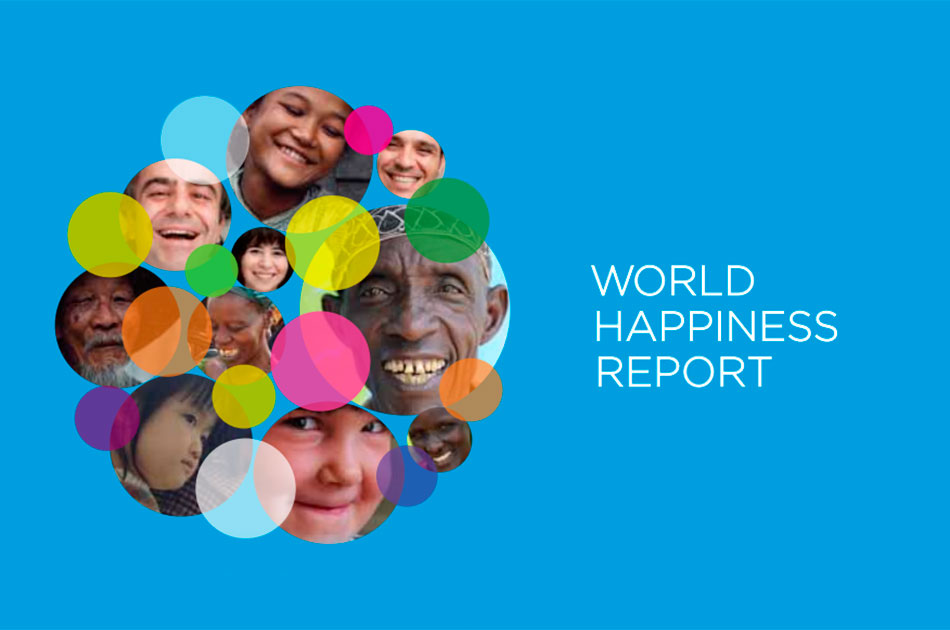
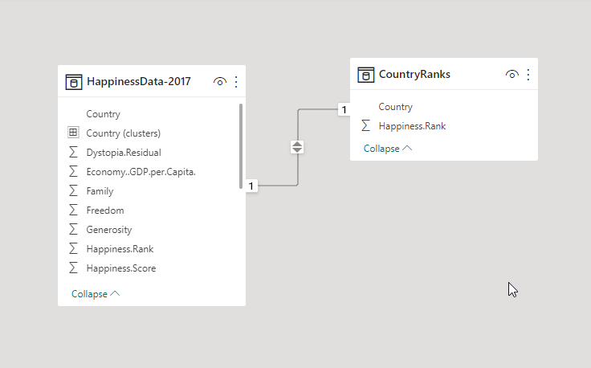
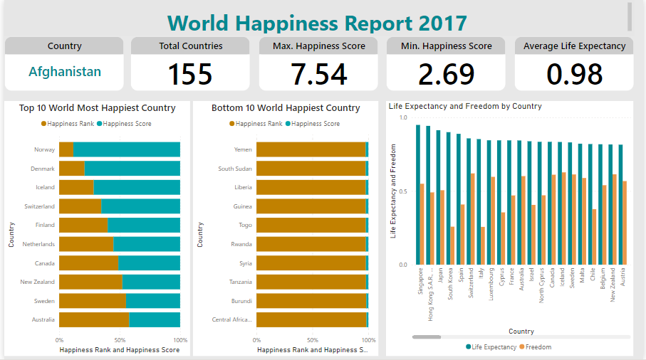
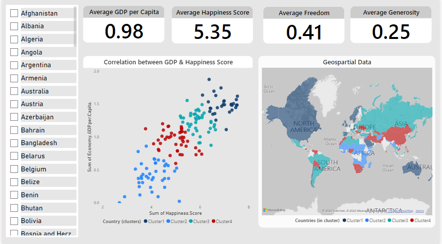

# World Happiness Data Analysis

## Introduction
This repository contains data on the **World Happiness Report 2017,** which ranks 155 countries by their happiness levels. The data was fetched from Kaggle, and it includes the following variables:

- Country: The name of the country.
- Happiness Score: A measure of happiness, based on a survey of respondents' life evaluations.
- Economy: GDP per capita.
- Social Support: The extent to which people feel supported by their social networks.
- Healthy Life Expectancy: The number of years a person can expect to live in good health.
- Freedom: The extent to which people feel free to make life choices.
- Generosity: The extent to which people give to charity or help others in need.
- Trust: The extent to which people trust their government and other institutions.

## Objective
We will analyze a large dataset of 155 countries' data to discover insights that will help us make data-driven decisions about why social-economic factors play a vital role in determining the world's happiness score and rank. 
_Disclaimer: All datasets and reports do not represent any institution or country, but a personal project to demonstrate capabilities of using Power BI for data visualization._ 

## Problem Statement
1. What are the factors that contribute to happiness? 
2. Are there any differences in happiness levels between countries?
3. What is the relationship between happiness and social economic factors, such as GDP, Life Expectancy, and Freedom?

_These are just three of the many possible problem statements that could be explored using the World Happiness data. By answering these questions, we can gain a better understanding of what makes people happy, and we can begin to identify ways to improve happiness levels around the world._

## Skills/Concepts demonstrated 
The following Power BI features were incorporated:
- Data cleaning and preparation
- Data analysis
- Filters
- Modelling
- Data Analysis Expression (DAX)
- Measures
- Data visualization
- Reporting

## Data Modelling
The data represents a single year of data which automatically derived a relationship. However, a custom column was created to have a separate table - **CountryRanks** for the purpose of the analysis. 

The derived table is joined to the fact table with a one-to-many relationship. 

## Data Visualization 
The happiness score and ranks of all countries were compared, with the top and bottom 10 countries filtered out to focus on the most relevant data for the problem statements and questions at hand.
The report contains three (3) pages:
1. Report page
2. Correlation and Map Analysis
3. Top failed states and their ranks across the world

## Analysis

### Features:
- The scatter plots represent each country's happiness score on the GDP scale. Lower GDP countries below the Average GDP per Capita represent a proportional happiness score, and vice-versa.
- The map shows the interactivity between the scatter plots, as well as countries selected on the slicer

## Conclusion
- The World Happiness Report ranks 155 countries on a scale of 0 to 10, based on how happy their citizens report being.
- The score is based on responses to the main life evaluation question in Gallup World Poll.
- Norway ranks first in the world for happiness, while the Central African Republic ranks last. Other countries in the bottom 10 include Yemen, Burundi, and South Sudan.
- These factors are economic production, social support, life expectancy, freedom, absence of corruption, and generosity.  
- The Dystopia Residual metric is a measure of how much happier a country is than a hypothetical country with the worst possible scores on the six factors of happiness.
- Singapore ranks highest in happiness among countries with low levels of trust in government.
- In addition to the six factors of happiness, future reports could also consider using qualitative methods to measure happiness, such as surveys and interviews. This would help to provide a more comprehensive understanding of what makes people happy.

## Recommendations
Based on the above conclusions, here are some recommendations for future reports:
- Collect data from a wider range of countries, including more countries from the global south to capture all 195 countries in the world.
- Use more qualitative methods to measure happiness, such as surveys and interviews.
- Consider using other corresponding variables to measure happiness, such as time spent working versus time spent in leisure, youth unemployment, and general unemployment level.

By following these recommendations, future reports could provide a more accurate and comprehensive picture of global happiness levels.

